# 🚀 Nexory - Sistema Integral de Gestión Comercial

Aplicación de escritorio desarrollada con **C#, Windows Forms y SQL Server**, diseñada para optimizar la gestión comercial mediante herramientas de administración de clientes, productos, facturación y generación de reportes.

---

# 🎥 Video Demo

### Ver demostración completa del sistema

https://github.com/user-attachments/assets/da31e85a-332a-49bf-8907-fea14c8efa8c

---

# 📋 Descripción

**Nexory** es una solución de gestión comercial orientada a pequeñas y medianas empresas que necesitan centralizar y optimizar sus procesos administrativos.

El sistema permite:

- Gestión de clientes

- Gestión de productos

- Facturación comercial

- Generación de reportes

- Administración de información empresarial

- Integración con SQL Server

- Reportes profesionales mediante Crystal Reports

La aplicación fue desarrollada siguiendo una **arquitectura multicapa**, promoviendo una mejor organización del código, escalabilidad y mantenibilidad.

---

# ✨ Funcionalidades Principales

### 👥 Gestión de Clientes

- Alta de clientes

- Modificación de clientes

- Eliminación de clientes

- Búsquedas y consultas

### 📦 Gestión de Productos

- Alta de productos

- Actualización de información

- Control de inventario

- Administración comercial

### 🧾 Facturación

- Generación de facturas

- Cálculo automático de importes

- Gestión de detalle de productos

- Registro de operaciones comerciales

### 📊 Reportes

- Reportes de clientes

- Reportes de productos

- Visualización profesional mediante Crystal Reports

### 🗄 Base de Datos

- Persistencia de información en SQL Server

- Consultas optimizadas

- Gestión relacional de datos

---

# 🛠 Tecnologías Utilizadas

- C#

- .NET Framework 4.7.2

- Windows Forms (WinForms)

- SQL Server

- Crystal Reports

- ADO.NET

- Git

- GitHub

---

# 🏗 Arquitectura del Proyecto

```text

Nexory-WinForms

│

├── database

│   └── script.sql

│

├── docs

│   └── screenshots

│

└── src

&#x20;   ├── CapaPresentacion

&#x20;   ├── CapaEntidad

&#x20;   └── CapaDatos

```

## CapaPresentacion

Contiene toda la interfaz gráfica del sistema y la interacción con el usuario.

## CapaEntidad

Contiene las entidades de negocio utilizadas por la aplicación.

## CapaDatos

Gestiona la conexión con SQL Server y todas las operaciones de acceso a datos.

---

# 📸 Capturas de Pantalla

## Login

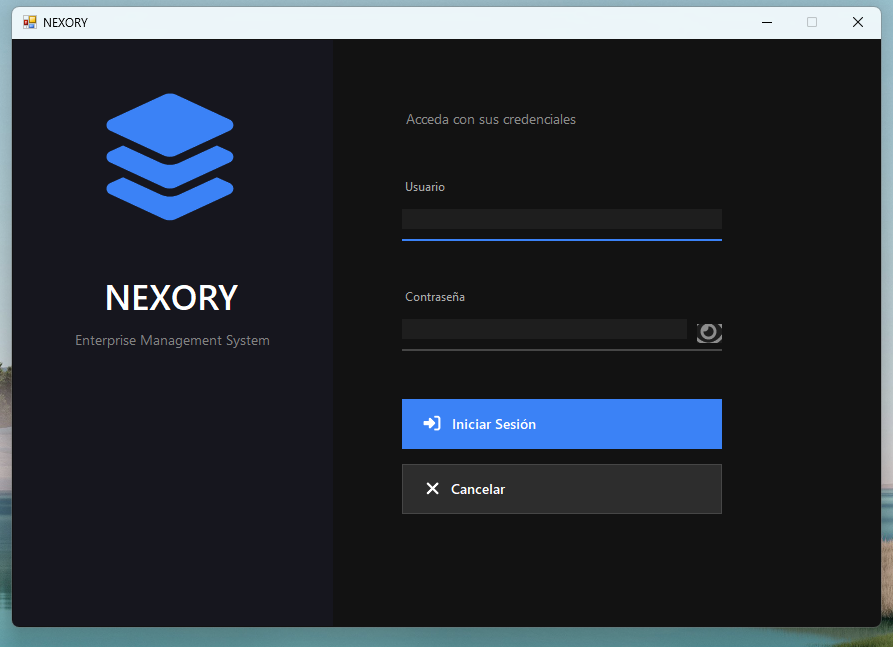

---

## Menú Principal

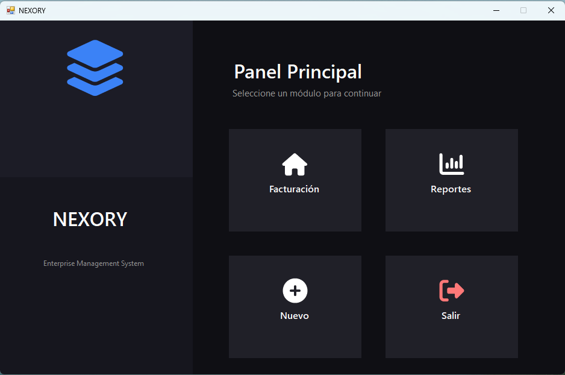

---

## Inicio

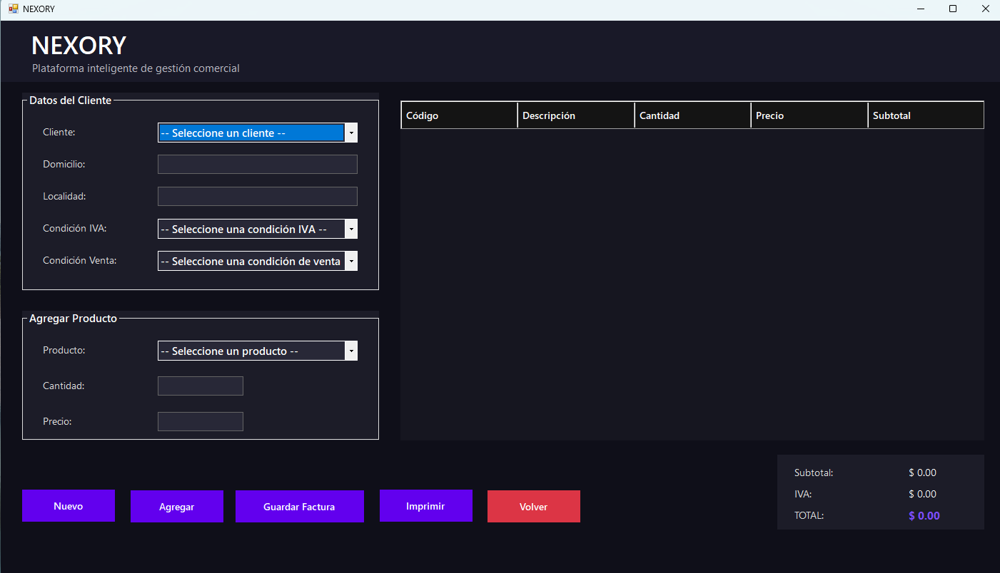

---

## Gestión General

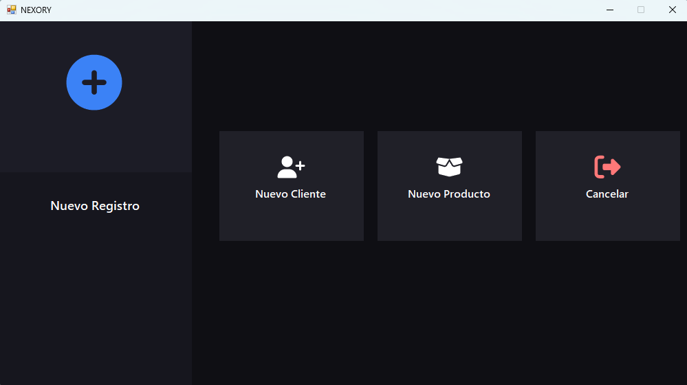

---

## Gestión de Clientes

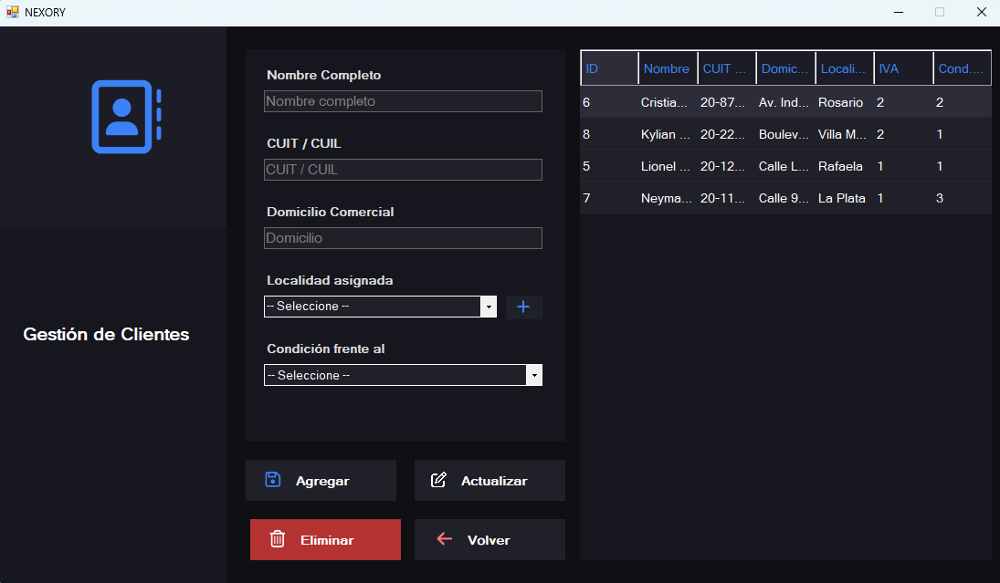

---

## Gestión de Productos

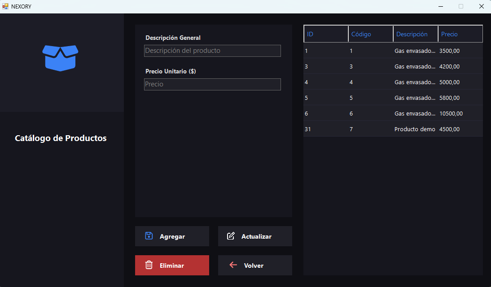

---

## Facturación

### Factura - Vista 1

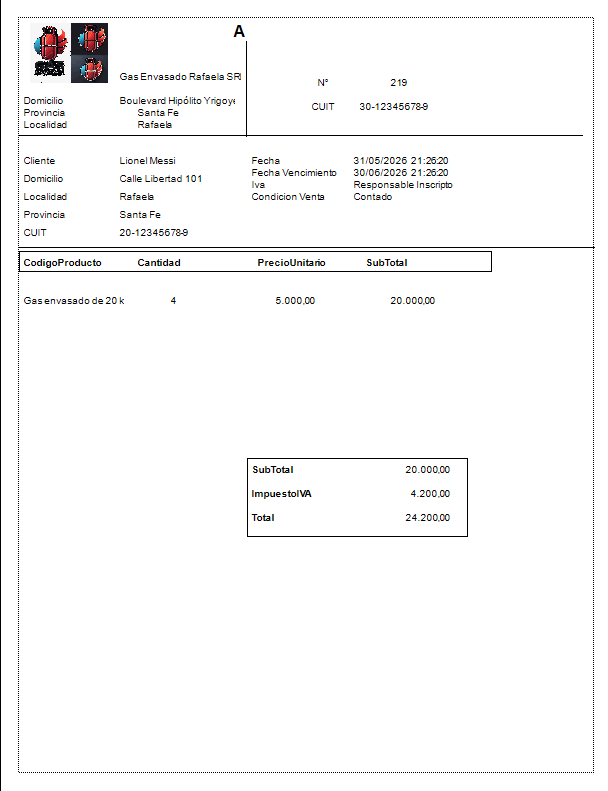

### Factura - Vista 2

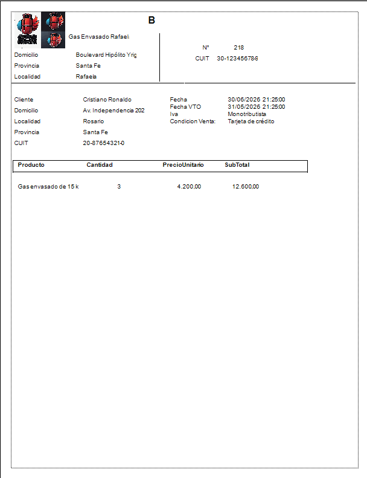

---

## Reportes

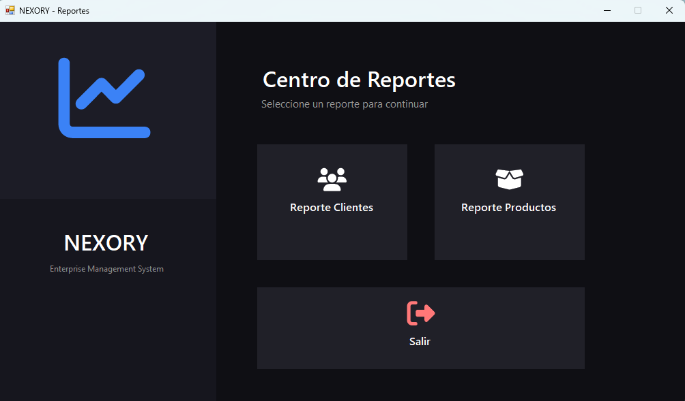

---

## Reporte de Clientes

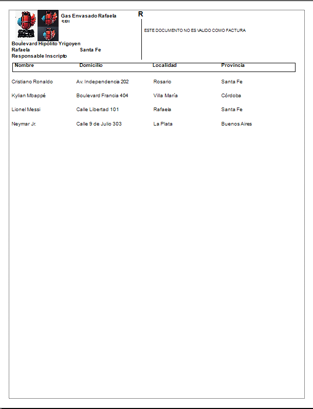

---

## Reporte de Productos

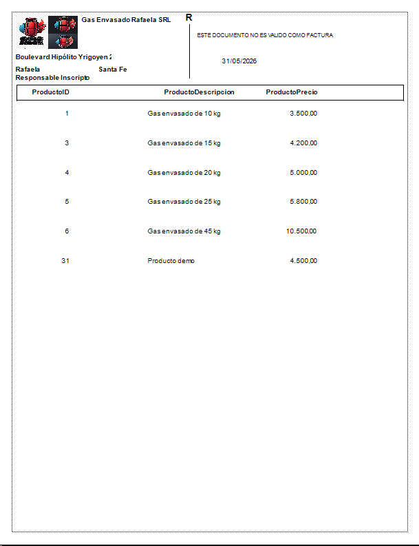

---

# ⚙️ Base de Datos

El script completo de creación de la base de datos se encuentra disponible en:

```text

database/script.sql

```

Cadena de conexión utilizada durante el desarrollo:

```xml

Data Source=SERVIDORSQLEXPRESS;

Initial Catalog=DB_Facturacion;

Integrated Security=True;

```

---

# 🚀 Instalación

### 1. Clonar el repositorio

```bash

git clone https://github.com/JSebastian1312/Nexory-WinForms.git

```

### 2. Crear la base de datos

Ejecutar:

```text

database/script.sql

```

en SQL Server Management Studio.

### 3. Configurar la conexión

Modificar las cadenas de conexión ubicadas en:

```text

src/CapaDatos/App.config

src/CapaPresentacion/App.config

```

### 4. Abrir la solución

```text

src/ProyectoSistemaFacturacion.sln

```

### 5. Restaurar paquetes NuGet

Restaurar las dependencias necesarias desde Visual Studio.

### 6. Compilar y ejecutar

Ejecutar el proyecto desde Visual Studio.

---

# 🎯 Objetivos del Proyecto

- Aplicar arquitectura multicapa.

- Implementar buenas prácticas de desarrollo.

- Gestionar información comercial de forma eficiente.

- Utilizar SQL Server como motor de base de datos.

- Integrar Crystal Reports para reportes profesionales.

- Implementar control de clientes, productos y facturación en una única plataforma.

---

# 👨‍💻 Autor

## Juan Sebastián Rivadero

**Desarrollador de Software**

📍 Rafaela, Santa Fe, Argentina

### Tecnologías de interés

- Desarrollo Desktop

- Desarrollo Web

- Bases de Datos

- SQL Server

- Flutter

- Firebase

- Git & GitHub

---

⭐ Si te resulta interesante este proyecto, no olvides dejar una estrella en el repositorio.

H
